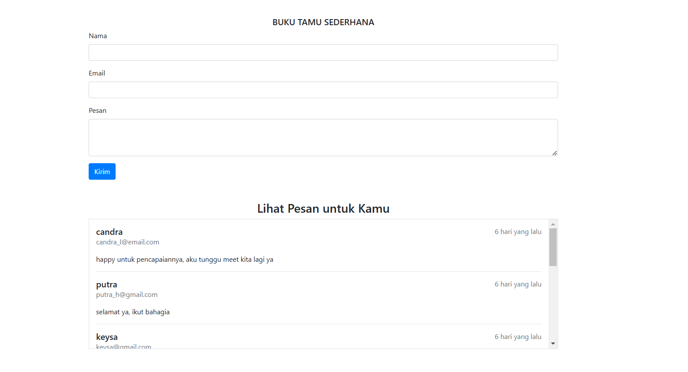

# BUKU TAMU SEDERHANA

Guestbook adalah buku tamu sederhana yang memberikan user memasukkan ucapan dan bisa melihat siapa saja yang mengucapkan ucapan selamat. Project sederhana ini sudah terhubung dengan database.

Buku tamu sederhana merupakan project sederhana dari proses belajar saya selama 181 hari untuk menjadi seorang Backend Developer.
Bahasa yang saya gunakan adalah PHP Native.

## Hasil Tampilan

## TAMPILAN BUKU TAMU SEDERHANA

 <!-- Ganti dengan path ke gambar beranda Anda -->
